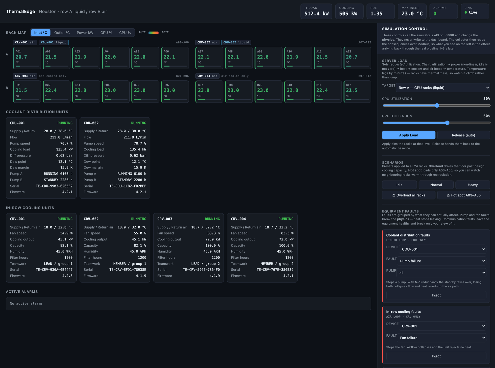
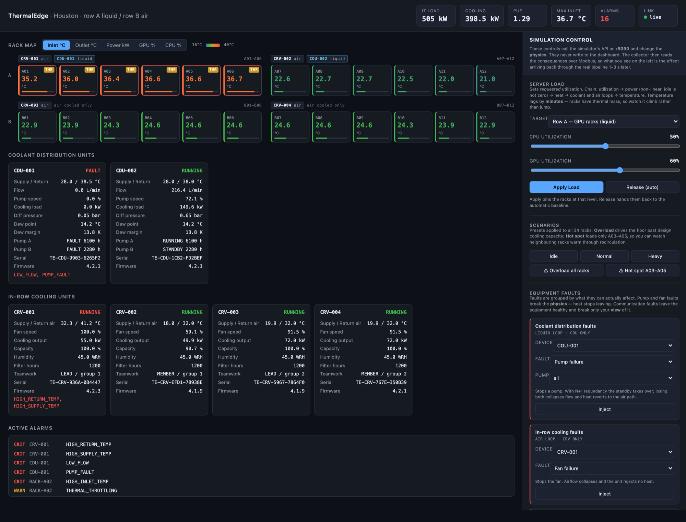

# ThermalEdge

**A clean-room data-center thermal management simulator.** Not affiliated with,
endorsed by, or derived from any vendor's products or documentation.

Every Modbus register address in this project is **invented for the simulation**
and has been verified against no vendor specification. The *parameter set* —
return/supply air temperature, humidity, coolant flow and pressure, dew point,
pump speed, compressor data, filter hours — reflects quantities that in-row
coolers and coolant distribution units genuinely report, because that is what
makes the simulation worth building. The addresses are this project's own.

Vertiv publishes real register maps (the Liebert IntelliSlot Modbus and BACnet
Protocols Reference Guide, SL-28170) which use a different address range
entirely. If you want this simulator to speak a real product's map, replace
`sim/registers/*.yaml` — that is the one file the rest of the system is built
from, and nothing else changes.

## What it is

A simulated data center that speaks real Modbus TCP, monitored by a collector
that has no idea the equipment is fake — which is exactly how it would be
pointed at physical hardware.

The simulation is driven by physics rather than random numbers: IT load produces
power through non-linear power curves, power becomes heat, heat splits between
the direct-to-chip liquid loop and the air path, control loops chase setpoints,
and rack inlet temperatures emerge from a recirculation matrix. Cooling failures
throttle compute, which sheds heat, which self-limits the failure.

Design documents: `Phase1.docx` (simulator core and live pipeline) and
`Phase2.docx` (historical data, workload scheduler, control UI, test automation).



*24 racks in two rows, each row split into the two cooling zones that serve it.
Row A is liquid-cooled GPU — every rack has both a CRV for residual air heat and
a CDU for the direct-to-chip loop. Row B is air-cooled CPU, so it has no CDU at
all. Every value shown was read from a Modbus register by the collector, not
from simulator internals.*



*The same floor 75 seconds after a pump failure on CDU-001. The fault stops at
the zone boundary: A01–A06 are hot and throttling, A07–A12 beside them are
untouched. Coolant flow is 0.0 L/min, both pumps read FAULT, and the orphaned
heat has reverted to the air path and driven CRV-001 supply air from 18.0 °C to
32.5 °C at 100% capacity. Nothing scripts that — it falls out of which racks the
unit serves.*

## Site layout

Two relationships, and they are not the same thing.

**Cooling assignment** — each unit serves six contiguous racks:

```
ROW A  GPU, dual-cooled                 ROW B  CPU, air only
 A01 A02 A03 A04 A05 A06                 B01 B02 B03 B04 B05 B06
 └───── CRV-001 ─────┘  air 25%          └───── CRV-003 ─────┘  air 100%
 └───── CDU-001 ─────┘  liquid 75%
 A07 A08 A09 A10 A11 A12                 B07 B08 B09 B10 B11 B12
 └───── CRV-002 ─────┘  air 25%          └───── CRV-004 ─────┘  air 100%
 └───── CDU-002 ─────┘  liquid 75%
```

| | Row A | Row B |
|---|---|---|
| Profile | GPU, 5 nodes/rack, ~34 kW | CPU, 28 nodes/rack, ~18 kW |
| Liquid capture | 75% to the CDU | none |
| Air | 25% to the CRV | 100% to the CRV |
| Units | 2 CRV + 2 CDU | 2 CRV |

**Thermal coupling** is separate, and distance-based. A rack's own exhaust
recirculates to its inlet at `0.090`; immediate neighbours contribute `0.050`,
then `0.023`, then `0.010`, then nothing. It is zero across the aisle — row A
never warms row B.

Crucially, coupling **crosses the cooling boundary**: A06 and A07 couple at
`0.050` despite being on different CDUs. So when CDU-001 fails, A07 does warm
slightly — it sits downwind of A06's exhaust — but not enough to cross the
throttle threshold, while A01–A06 all do. If the boundary were perfectly clean,
it would look like six racks had been flagged rather than heated.

The layout travels with the device inventory (`config/devices.yaml`) and is
served at `/api/topology`, because a monitoring system knows which unit is in
front of which rack from commissioning records — not by asking the equipment.


## Status

**Phase 1 is complete.**

| Component | State |
|---|---|
| Register maps (CRV / CDU / PDU) — 84 points | done |
| Device-scoped fault catalogue with API validation | done |
| Simulation engine (clock, load, thermal, control, psychrometrics) | done |
| Topology and rack coupling matrix | done |
| Modbus TCP server, FC 0x2B, fault injection | done |
| Device identity, serials, components, device-swap detection | done |
| Simulator control API | done |
| Collector (async, batched reads, offline detection) | done |
| Telemetry API + WebSocket | done |
| Dashboard + permanent control panel | done |
| Test suite — 183 tests | passing |
| CI (GitHub Actions) + end-to-end smoke | done |
| Docker Compose | done |
| Everything in Phase 2 | not started |

## Run it

```bash
docker compose up --build
```

Then open **http://localhost:8000**. The simulation control panel is the right-hand sidebar.

Without Docker:

```bash
python3 -m venv .venv
./.venv/bin/pip install -r requirements-dev.txt

./.venv/bin/python -m sim.main     # terminal 1: Modbus + control API
./.venv/bin/python -m api.main     # terminal 2: collector + dashboard
```

Architecture and data-flow reference: **[`docs/architecture.html`](docs/architecture.html)** —
open it in a browser for the wiring diagrams.

| Service | Port | What |
|---|---|---|
| Dashboard + telemetry API | **8000** | rack map, cooling, alarms, WebSocket |
| Simulator control API | **8090** | load, faults, humidity, clock — `/docs` for OpenAPI |
| Modbus TCP — CRV | 5020-5023 | one listener per unit |
| Modbus TCP — CDU | 5030-5031 | one listener per unit |
| Modbus TCP — rack PDU | 5040 | 24 racks behind one gateway, by unit id |

Things worth trying in the control panel:

- **Overload all racks** — cooling saturates, supply air climbs, inlet temps rise
- **Hot spot A03–A05** — watch neighbouring racks warm through recirculation
- **Pump failure on CDU-001** — the six racks in that cooling zone heat up and
  throttle while the zone beside them stays green; the rack map is grouped by
  serving unit, so the boundary is visible
- **Room humidity to 95%** — the CDU is forced to raise coolant supply above the
  dew point and loses capacity, with no equipment fault anywhere
- **Device offline / network latency** — the collector detects it over Modbus

Headless alternative, no services needed:

```bash
./.venv/bin/python scripts/demo.py     # load step + pump-failure cascade, no services needed
./.venv/bin/python -m pytest           # 183 tests
```

With both services running:

```bash
./.venv/bin/python scripts/smoke.py           # proves the pipeline end to end
./.venv/bin/python scripts/check_controls.py  # proves each control does what it says
```

## How simulation control works

The control panel is a **test fixture**, not part of the monitored system. This
distinction is the whole point of the project, so it is worth being precise.

```
  YOU (browser :8000)
        |
        |  control  -- HTTP POST -->  Simulator control API  :8090
        |                                      |
        |                             changes the PHYSICS
        |                             (load, faults, humidity, clock)
        |                                      |
        |                             simulation step, 1 Hz
        |                                      |
        |                             register banks re-encoded
        |                                      |
        |                             Modbus TCP  :5020-5040
        |                                      |
        |                                 Collector   (polls, decodes)
        |                                      |
        +<-- telemetry -- WebSocket --  Telemetry API  :8000
```

Nothing you click writes to the dashboard. A control action changes simulation
state; the collector then discovers the consequences by **polling Modbus
registers**, exactly as it would from real equipment. What you see on the left
is the effect arriving back through the full pipeline, typically 1–3 seconds
later. The collector contains no code path that knows the simulator exists.

That is why the browser holds two separate connections — telemetry in from
:8000, control out to :8090. It mirrors a hardware bench, where the load bank is
driven separately from the BMS observing it.

### What each control actually does

| Control | Mechanism |
|---|---|
| **CPU / GPU sliders** | Sets *requested* utilization and pins the racks. Chain: utilization → power (non-linear; idle is ~45% of peak for CPU) → heat → split between coolant loop and air path → temperature. |
| **Release** | Unpins, returning racks to the automatic diurnal baseline. |
| **Overload** | All 24 racks to 100%. Exceeds design cooling capacity, so CRVs saturate and supply air temperature climbs. |
| **Hot spot** | Loads only A03–A05. Neighbours warm through the recirculation matrix — the coupling is real, not scripted. |
| **Pump / fan failure** | Breaks the **physics**: heat stops leaving. Liquid heat reverts to the air path, racks throttle, load sheds, the system settles degraded. |
| **Sensor / latency / offline** | Breaks the **communication**: equipment is fine, the monitoring system just cannot see it correctly. |

Faults are grouped by what they can actually affect, and the API enforces it:

| Section | Faults | Applies to |
|---|---|---|
| Coolant distribution faults | pump failure (per pump, or both), reduced flow | CDU only |
| In-row cooling faults | fan failure, reduced airflow | CRV only |
| Communication faults | sensor freeze, network latency, device offline | any of the 30 devices |

`sim/faults.py` is the single source of truth: the API validates against it and the
control panel builds its sections from it, so the two cannot drift. Asking for a pump
failure on a CRV returns `400` with *"'Pump failure' does not apply to a CRV. It applies
to: CDU."* rather than succeeding and silently doing nothing.
| **Humidity** | Raises the dew point. The CDU may not drive coolant below dew point + margin, so it is *forced* to raise supply temperature and loses capacity — a cooling failure with no equipment fault. |
| **Time scale** | Speeds the simulation clock (the `ScaledClock`). Polling cadence stays real-time. |

Temperature always **lags** load by minutes, because racks carry thermal mass.
If it ever jumped instantly, the physics would be wrong.


## Repository layout

```
docker-compose.yml       two services: simulator + api
Dockerfile               one image, both roles
.github/workflows/ci.yml lint + tests on 3.11/3.12, plus an end-to-end smoke job
config/devices.yaml      device inventory and site layout -- the collector's
                         only configuration

sim/
  registers/*.yaml       single source of truth for every telemetry point
  regmap.py              register loading, validation, Modbus codec
  engine/clock.py        WallClock / VirtualClock / ScaledClock
  engine/load.py         power curves, air and liquid throttle policies
  engine/thermal.py      heat transfer, thermal mass, rack coupling
  engine/control.py      PI controllers, conditional-integration anti-windup
  engine/psychro.py      dew point (Magnus)
  engine/state.py        SimState and the single step() contract
  topology.py            rows, racks, cooling equipment, coupling matrix
  identity.py            deterministic serials, components, rack asset tags
  faults.py              fault catalogue + device-type validation
  points.py              SimState -> device-visible telemetry points
  modbus_server.py       hand-rolled MBAP framing, FC 0x03/04/06/10/2B
  devices.py             device inventory and site layout
  simulator.py           physics loop, listeners, fault state
  admin_api.py           control API (the test fixture)
  main.py                entrypoint: Modbus listeners + control API

collector/
  batching.py            contiguous read planner
  collector.py           async poller, decode, offline + device-swap detection

api/
  main.py                WebSocket hub, snapshot and topology APIs
  static/index.html      dashboard + simulation control sidebar

scripts/
  demo.py                headless physics demo, no services needed
  smoke.py               end-to-end pipeline check (also a CI job)
  check_controls.py      exercises every control in the panel

docs/
  architecture.html      wiring and data-flow diagrams
  screenshots/           dashboard and pump-failure captures

tests/                   183 tests -- register contract, protocol integration,
                         physics, faults, identity, collector, API
```

## Design notes worth knowing

- **`step(state, dt, inputs)` performs no I/O and never reads a wall clock.**
  Time arrives only as `dt`. That is what makes fast-forward history generation
  (Phase 2) and a test suite covering hours of simulated time in seconds
  possible from the same code.
- **Modicon `30001` is input-register offset `0`.** `return_air_temp` at
  `30036` reads at offset `35`. This is pinned by a test rather than merely
  avoided.
- **The exhaust integrator uses the exact exponential solution, not forward
  Euler.** Phase 2 generates history at `dt=10s` while live mode runs at
  `dt=1s`; a conditionally-stable integrator would make the seam between them
  visible in every chart.
- **Air and coolant have separate throttle policies.** A direct-to-chip loop at
  38 °C return is healthy; judging it against the 32 °C air-inlet threshold
  throttles every liquid rack during normal operation.
- **The Modbus server is hand-written rather than pymodbus's.** As of pymodbus
  3.15 the classic datastore path is deprecated and its replacement models
  static register content, not values recomputed from live state per read. The
  collector uses the real pymodbus *client*, so the wire framing is validated
  against an independent implementation on every poll.
- **The dashboard shows only what the collector observed over Modbus.** It never
  reads simulator internals. If a value is not exposed as a register, it does
  not appear on screen.
- **Device identity is deterministic, never random.** Serials are derived by hash from a
  fixed seed, so they survive restarts. Regenerating them would make the device-substitution
  detector fire on every boot and break Phase 2's generated history. A rack's *asset tag* and
  its PDU's *serial* are separate fields — swapping a failed PDU must not change the rack's
  identity.
- **Identity is served two ways**, as it is in the field: vendor-specific string registers,
  and Modbus function code `0x2B` / MEI type 14 (Read Device Identification).
- **Control never traverses the telemetry path.** The browser talks to :8090 for
  control and :8000 for telemetry, exactly as a bench rig drives a load bank
  separately from the BMS watching it.
- **Site layout is configuration, not telemetry.** Which cooling unit serves
  which rack travels with the device inventory and is served at
  `/api/topology` — no real BMS asks a rack PDU which CRV is in front of it. It
  is what lets the rack map group itself by cooling zone, so a fault that hits
  one unit visibly stops at that zone's boundary.
